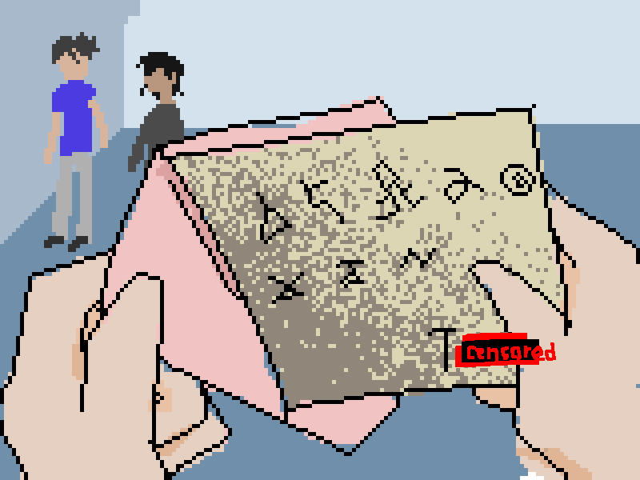

## 梦境1

    仍然是和t和c在一起在一个新的学校漫无目的的游荡着。我们住的很近，在一栋宿舍楼上。我自己一间他们两个一间。

    在梦境的前半部分一切都是很好的进行着的。没有作业，没有考试，我们可以尽情玩自己喜欢的东西。我记得t在我回宿舍前给我塞了个信，上面写着注意锁门 小心安全，这种话，就像这样：

后面的话，一切就变了。

事情转变的原因是我发生了“异常”。然后T开始躲避我，同时C发现了T这封信的署名原先是给另一个人的。

在梦中那个人的名字没有被写对，但是我能看出是...那个人。那个人的名字的最后一个字被改成了粤。

> 让我来引用一些在现实生活中的背景吧。
>
> 那是...之前在现实生活中，在一年半前抢走我一切的人...我的生活，我本应该在那个时候来到这里的...
>
> 虽然已经过去一年半了，但是那个人仍然是我的噩梦。
>
> 那个人不再是那个人，而是抽象成了一个符号，代表什么呢？大概是穷尽吧。

虽然在现实中的我可能会明白一切的合理性，但是在梦中的那个我受不住这种打击，感觉一切开始支离破碎。

在梦境穷尽前，c脸上带着嘲讽的表情看着我，好像在说：

> *小子，我早就告诉过你的，他曾经的所作所为。你应该早就能预见到你的这种结局。*

然后...

### 梦境结束，原因：*不记得之后发生什么了*
