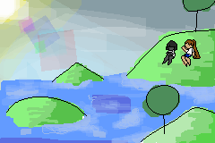

## 梦境1

    我生成在一个住宿学校里。

    学校的特色就是水。

    学校负一到三层都是无边无际的水，三层开始出现地表浅浅的一层水，有各种方形的排水沟供水通行。

    二层便有浴缸尺寸级别的泳道可以供我们在水中通行了。

    一层的陆地都算稀少，放眼望去是一个无边无际的池子，上面的人行道陆地就像是大电路板上交错的刻线。

    负一层，据说只有学校议会级别的人能安全地去，安全地回来。虽然去那里的通道一直开着，但是鲜有人去。去那里的普通学生只有一半能活着回来。据说那里暗流交错，连空气都是珍稀的生存资源，丛横交错的地下通道充满了水。

    负二层，据说栖息着什么。那是流放的学生吗？还是变异的未知生命？我也不知道。

    再往下，就是谁都不知道的了。

    而四层是唯一干燥且向所有人开放的地方。那里的环境就像是学而思课外补习班。唯一不同的地方就是，水，另一种意义上的水。如果说一般大学的水是老师糊弄学生摸鱼，那么这里的水就是根本没有老师来上课。每一节课教室的大门都会向我们敞开，但是里面却是一番活动室的光景。

    向学校外望去，只能看到水，和茫茫的雾。这是一个水世界，但是远处会隐隐约约浮现陆地和树的光影。每次退潮隐约有陆地的时候，总是有学生拿着望远镜去看。这个时候他周围总是会聚集一圈的同学。大家都对陆地感到新奇与兴奋，但是没有一个人出学校去真的探索。

    令人非常奇怪的是水全部都是清澈并且干净的，不会因为人在地上走而变脏。

    和水包容万物的特性相悖，学校的等级制度却是数一数二地严厉。从五层开始，除了学生会成员，教职工之外的人便不能向上了。如果说一层二层是一个学校应有的建筑，那三层开始墙壁便开始有金色线条勾勒的纹路，四层装横就开始变得以琉璃和金的颜色为主题。而五层，我在梦境的后面会提。

    今天的梦境一样是三个人，但是成分发生了改变。不再是我，t和c，而是我和一个女性鲛人以及一个...不知道是谁的男生。

    然后我们从一楼游出去了。

    说实话，想离开这个鬼地方有两种方式：一种是用飞的，另一种是游出去。从四楼窗户出去，不仅飞行器械是一个难点，用飞的还容易被发现和击落，并且飞行的速度也很堪忧。但是我们游的速度要比跑步快。

    然后我们朝着上次发现有陆地的地方游了。

    我重温了一下怎么游泳（）

    我只记得那个女生了（高马尾，长发，运动短袖短裤）

    我们到了所谓的陆地，那是一块有很多多边形小山的地方，下面是一层浅浅的水，我甚至可以调太阳的位置让光投影在不同的地方。

    我当时还在想怎么把太阳移动到学校上方，让我们呆在山坡上的场景更有美感。

    这就像是一块位于地图边缘的没有建模好的地方。

    然后到了晚上我们应该往回游了。

    然后我们很惊险地躲过了巡逻的警卫回到了学校，同样走的是水路。

    然后我发现游和走楼梯都不能到达的五层，原来坐电梯能直接到。只要你说你是这里的访客就可以。

    五层的装饰大概比四层还要华丽一些，是黑色背景点缀金色装饰然后加了很多灯光光效，像是什么大厅。我说自己是访客，薅了一大堆那边的免费糖果，再把那边的独立卫生间当私人包间用。然后让我朋友在外面等着。（这样是不是说明了学生的地位还不如访客...?）

    然后我记得后来我这么做被发现了，逃跑的时候依然是躲卫生间--出来迅速移动的循环。

### *然后就不记得了，梦结束。*
