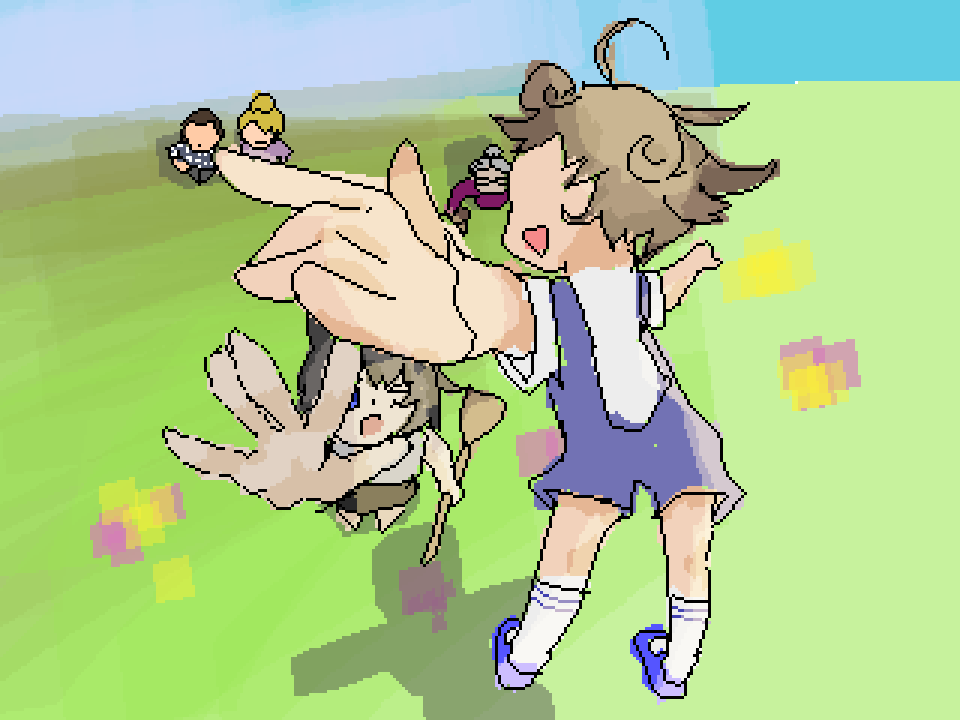

## 今天的

    今天是和“家人们”一起搬迁？

    在这个设定里，我的家庭组成是我，一个4岁左右的小男孩，然后还有一个女人，爷爷奶奶以及父亲。

    虽然我很想学会怎么飞但是他们一直说“没有必要”。

    那个小男孩是我们几个里面唯一会飞的人。他只要戴着手环拿着一个棍状物就能飞起来，哪怕这是个树枝子。但是我去尝试把他拿着的树枝子捡起来却飞不起来，最多只能跳得比较远。

    我们要去很高的地方搬迁，再回到家里。我们在不断地往上走但是却一直在相似的场景中循环：绿色的草地和浅蓝色的天空，然后有白色大理石和破碎镜面的遗迹。

    场景大概是这样的：

    

    然后我费尽力气让那个小朋友告诉我他为什么能飞，他告诉我很简单，只要调整好两只手放在棍状物的前后就可以了。

    于是在路上我就拿着树枝子一直练习，终于快要飞起来的时候梦醒了。

**（悲）**
