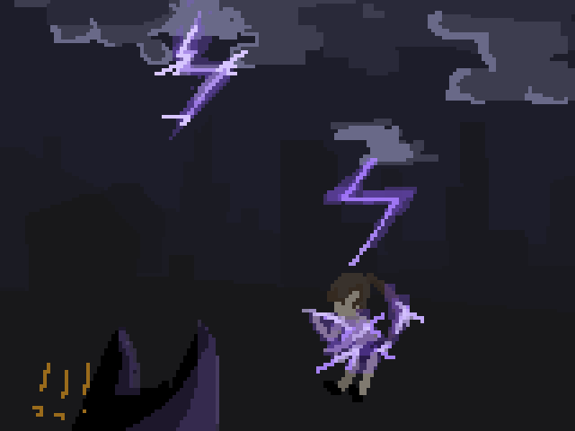

0310
    一开始还是我，T和C呆在一个地方打算出去玩，然后在准备去外面。

    我们所在的环境是一个大得多的实验室。有大厅和走廊，但是仍然没有窗户。整个实验室以金黄色的色调为主。

    他们在制作一个叫做“皮肤”的神奇的东西，在迈出实验室后可以防止自己的皮套下身份暴露，也就是一个外表。

    主要是C在做这个东西。

    然后我看上了他做的一个穿着白色短袖（上面有金色小鱼干）的宝可梦训练师的形象。

    T做的形象可能主要是...萝莉吧。我一直对萝莉有心理阴影所以就没碰他做的东西。

    然后我套着皮就和他们一起出去了。外面是灯光都很难看清的暴风雨夜晚，同时电闪雷鸣。

    然后T和C消失了，表姐出现了并且陪着我，但是表姐实际上是T。（身份，行为推断）

    好像是半路上我遇到了簇，他和他同行的人带了穿梭器，类似恶灵的那种结印用法，上面还带一个签到登录器，他和他的同行人就这么瞬移走了。

    然后到了黑夜中唯一散发着光的地方，一个课外班，里面大概坐了十来个学生。外面的色调是深蓝色而里面是暖光的颜色。里面的布置和教室一样。表姐就这么在最后一排坐着。

    簇因为迟到了被老师扔了出来，他开了相位移动器然后开大跑了。我因为没有钱不能上课外班。然后我就在教室后面隔了一层玻璃围观着。

    那个老师是一个年轻女性，长得很好看但是我完全不想靠近，感觉很凶。

    然后课间的时候那个老师非常狂地把后置窗户开了个缝然后骂那些污言秽语的东西，穷逼之类的。然后我开始了挑衅，我把随身携带的废电池炸弹投了进去。然后那个老师很勇并且很作死，把我扔进去的废电池点了，我看到周围的学生表情由惊讶和起哄变成了害怕。废电池炸开后在场的所有人都受到了波及，尤其是坐在最后一排的表姐。这个Debuff是会吸引雷电。

    然后我看青色的雷电冲着我们猛地冲下来，人吓傻了。

    她拉着我跑了，我们冲向旁边的一个很大并且高，有避雷针的建筑，建筑里几乎没有光亮，我们向上跑。

    奇怪的是，总是她在吸引雷电，然后我总是安全的。

    我们到第四层前，表姐就因为一直在吸引雷劈身上附满了雷电，她整个人被光包围着，然后动一下就会被电。她体力不支倒下了。

    我到了第四层然后发现这是201的拓展延伸。向无穷远延申的实验台，下面堆着的电脑配件，用不完的焊锡和线...然后还有除去实验台外空旷的地面。我被这个地方吸引住了。

--End--
